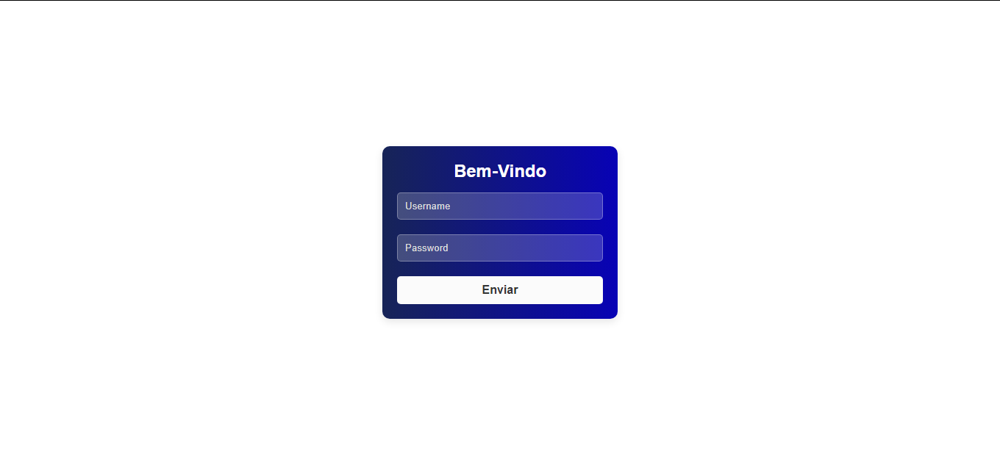

# Page Login Blue

Bem-vindo ao repositório do meu *Projeto Caixa*! Este projeto foi criado para pontuação na Infiniy School.

## 📋 Descrição

Este repositório contém o código-fonte para Pagine de Login, inteiramente criada por mim de forma responsiva. 

## 🚀 Funcionalidades

-  O objetivo é uma pagina de login bonita, atrativa e responsiva para sites e sistemas. 

## 🔧 Tecnologias Utilizadas

- *HTML5*: Estrutura da página.
- *CSS3*: Estilização e design responsivo.

## 🔗 Links Úteis

- *Instagram*: https://www.instagram.com/artedasredes/
- *Contato*: artedasredes@gmail.com
- *Link para acessar o site*: https://loginpageblue.netlify.app/
